# idea-to-deploy

> Полная методология жизненного цикла проекта для Claude Code — от идеи до задеплоенного продукта одной командой.

**Установка за 30 секунд:**

```bash
/plugin install hihol-labs/idea-to-deploy
```

Затем просто опишите задачу в Claude Code — методология сама направит в нужный скилл. [Полный гайд по установке](#быстрый-старт) · [End-to-End пример](#end-to-end-пример) · [Контракты скиллов](#контракты-скиллов).

[](LICENSE)
[](#скиллы)
[](#субагенты)
[](.claude-plugin/plugin.json)
[](https://github.com/hihol-labs/idea-to-deploy/actions/workflows/meta-review.yml)
[](CHANGELOG.md)
[](.claude-plugin/plugin.json)

**[English version (README.md)](README.md)** · **[Changelog](CHANGELOG.md)** · **[Контрибьютинг](CONTRIBUTING.md)** · **[CI](docs/CI.md)**

> Этот репозиторий — **плагин для Claude Code** (см. `.claude-plugin/plugin.json`). Установка регистрирует 38 скиллов и 10 субагентов в вашем окружении Claude Code — это не самостоятельный CLI.

## Демо

<p align="center">
  
</p>

> Смотрите также [End-to-End пример](#end-to-end-пример) ниже — пошаговый разбор реального запуска.

---

## Проблема

Claude Code мощный, но без инструкций работает как строитель без чертежа:
- Пишет код хаотично, пропускает тесты, не документирует
- Каждый раз выдаёт разную структуру и качество
- Может сломать то, что уже работает
- Нет методологии — просто генерация наугад

## Решение

**idea-to-deploy** — это методология, а не просто набор инструментов. 38 скиллов + 10 специализированных агентов, которые превращают Claude Code в профессионального разработчика с проверенным конвейером:

```
Идея → Вопросы → План → Архитектура → Код → Тесты → Ревью → Деплой
```

Каждый шаг проверяется. Каждая фича тестируется. Каждое решение документируется. Каждая сессия сохраняется.

## Быстрый старт

### Установка

**Требования:**
- [Claude Code](https://claude.com/claude-code) CLI ≥ 2.0 (или расширение для VS Code / JetBrains) с поддержкой плагинов
- Подписка Claude Pro / Team / Enterprise
- `git` в `PATH` (используется несколькими скиллами)

**Установка плагина:**

```bash
/plugin install hihol-labs/idea-to-deploy
```

**Проверка установки:**

После установки скиллы и агенты регистрируются по пути:

```
~/.claude/plugins/idea-to-deploy/
  ├── skills/          # 38 папок скиллов
  ├── agents/          # 10 определений субагентов
  └── hooks/           # опциональные хуки-энфорсеры (не ставятся автоматически)
```

Быстрая проверка внутри Claude Code:

```
/project
```

Если появился промпт роутера с вариантами А / Б / В — плагин работает.

**Обновление:**

```bash
/plugin update hihol-labs/idea-to-deploy
```

**Удаление:**

```bash
/plugin uninstall hihol-labs/idea-to-deploy
```

Заметки о релизах — в [CHANGELOG](CHANGELOG.md).

### Использование

Просто скажите что хотите:

```
Хочу создать сервис доставки еды
```

Claude Code:
1. Спросит какой маршрут предпочитаете (полный цикл / только план / есть документы)
2. Задаст уточняющие вопросы о проекте
3. Сгенерирует архитектуру и документацию
4. **Покажет план и подождёт вашего одобрения**
5. Построит проект шаг за шагом
6. Протестирует и проверит после каждого шага
7. Задеплоит

Когда закончите работу, просто скажите:

```
сохрани сессию
```

Контекст сессии — решения, прогресс, блокеры, следующие шаги — будет сохранён и автоматически восстановлен в следующей сессии.

## Как это работает

```
Вы: "Хочу сервис доставки"
         |
         v
    /project (маршрутизатор)
         |
    Спрашивает: А, Б или В?
         |
    +----+--------+--------+
    v              v              v
  А) Полный      Б) Только     В) Есть
  цикл           план          документы
    |              |              |
    v              v              v
 /kickstart    /blueprint     /guide
    |
    +-- Задаёт уточняющие вопросы
    +-- Генерирует 7 документов
    +-- Запускает /review (автовалидация)
    +-- ПАУЗА: показывает план, ждёт одобрения
    +-- Создаёт структуру проекта
    +-- Реализует пошагово:
    |     +-- /test после каждой фичи
    |     +-- Проверка: код = архитектура?
    |     +-- Исправления перед следующим шагом
    +-- Деплоит
```


## End-to-End пример

Минимальный разбор маршрута А (полный цикл):

```
Вы:    Хочу Telegram-бота для учёта тренировок в зале
Claude: [/project] А, Б или В?
Вы:    А
Claude: [/kickstart] задаёт 6 уточняющих вопросов
        (пользователи? авторизация? БД? хостинг? бюджет? срок?)
Вы:    личное использование, без auth, SQLite, локально, $0, за выходные
Claude: генерирует STRATEGIC_PLAN, PROJECT_ARCHITECTURE,
        IMPLEMENTATION_PLAN, PRD, README, CLAUDE_CODE_GUIDE, CLAUDE.md
        запускает /review → PASSED_WITH_WARNINGS (2 мелочи)
        показывает план, спрашивает: "Одобряете и начинаем код?"
Вы:    да
Claude: Шаг 1/9 — скаффолд проекта, коммит
        Шаг 2/9 — модели БД + /test
        ...
        Шаг 9/9 — скрипт деплоя + обновление README
        Готово. 42 теста зелёные. Ваш бот готов.
```

**Reference-фикстуры:** воспроизводимые golden-path сценарии, которые использует test runner, лежат в [`tests/fixtures/`](tests/fixtures/). Запуск — [`tests/run-fixtures.sh`](tests/run-fixtures.sh), чтобы увидеть поведение каждого скилла на известном входе.

## Скиллы

### Точки входа (6 скиллов)

| Скилл | Описание |
|-------|----------|
| `/project` | Маршрутизатор для **создания** нового — задаёт один вопрос и направляет в /kickstart, /blueprint или /guide |
| `/task` | Маршрутизатор для **работы с существующим кодом** — направляет в нужный daily-work скилл (/bugfix, /refactor, /doc, /test, /perf, /review, …) по типу задачи |
| `/adopt` | **Новое в v1.20.0.** Адоптация legacy-проекта в методологию — добавляет идемпотентный блок в `CLAUDE.md`, регистрирует project-level хуки в `.claude/settings.json`, бутстрапит memory dir, затем voice-chain в `/strategy` или `/blueprint` для plan-документов. Без reverse-engineering планов. |
| `/discover` | **Новое в v1.17.0.** Фаза product discovery — анализ рынка (TAM/SAM/SOM), исследование конкурентов, пользовательские персоны, приоритизация фич (MoSCoW + RICE). Генерирует `DISCOVERY.md` для `/blueprint`. |
| `/strategy` | **Новое в v1.19.0.** Стратегический пересмотр существующих проектов — gap-анализ по 5 измерениям, генерация вариантов с devil's advocate, ADR для pivot-решений, обновление LAUNCH_PLAN.md. |
| `/advisor` | **Новое в v1.19.0.** Советник/консалтинг-режим — только анализ (без изменения кода), многоперспективная оценка через business-analyst + devils-advocate субагентов. |

### Создание проекта (3 скилла)

| Скилл | Маршрут | Что делает |
|-------|---------|-----------|
| `/kickstart` | А) Полный цикл | От идеи до задеплоенного продукта: документы, код, тесты, деплой |
| `/blueprint` | Б) Только план | 6 файлов документации, без кода |
| `/guide` | В) Уже есть документация | Уже есть архитектура и план (после маршрута Б, от другого разработчика или из другого инструмента) — генерирует пошаговые промпты для реализации |

### Контроль качества (6 скиллов)

| Скилл | Описание |
|-------|----------|
| `/review` | Валидация документации и кода через детерминированную бинарную рубрику (BLOCKED / PASSED_WITH_WARNINGS / PASSED) |
| `/security-audit` | Read-only аудит безопасности в стиле OWASP (auth, секреты, инъекции, CORS/CSP, зависимости) с тем же enum статусов, что и у `/review` |
| `/security-guidance-setup` | **Новое в v1.29.0.** Security-компаньон — настраивает и интегрирует официальный [плагин security-guidance](https://github.com/anthropics/claude-code/tree/main/plugins/security-guidance) от Anthropic (бесплатный, ships default-on). Shift-left, всегда-включённый ревьюер кода от Claude: regex pattern-warnings на каждом Edit/Write, LLM diff-ревью на Stop (находки возвращаются до того как вы увидите ответ) и агентский commit/push-ревью кросс-файловых уязвимостей (IDOR, auth bypass, SSRF). Детектит установку, печатает проверенную CLI-команду, маппит на жизненный цикл. **Комплемент** к `/security-audit` (on-demand аудит), НЕ замена; код upstream не вендорится; гейты не затрагиваются. |
| `/cross-review` | **Новое в v1.30.0.** Кросс-вендорное второе мнение — прогоняет НЕЗАВИСИМУЮ внешнюю модель (OpenAI Codex CLI или Gemini CLI) по текущему диффу, чтобы поймать слепые зоны, которые Claude-ревью (`/review`) разделяет с кодом, который сам же написал. PII-scrub перед отправкой; fail-open цепочка codex → gemini → нативный red-team review Claude. **Аддитивно** к `/review` (обязательный пол качества), не гейт. Порт концепта cross-vendor review из omnigent. |
| `/grill-me` | **Новое в v1.21.0.** Интерактивный read-only стресс-тест планов, дизайнов, архитектуры и рискованных решений — задаёт по одному вопросу (с рекомендуемым ответом), чтобы вытащить допущения, риски и зависимости. Запускается до `/review`, не заменяет его. |
| `/browser-check` | **Новое в v1.21.0.** Локальный browser smoke-тест фронтенд/фуллстек/визуальных флоу через встроенный Playwright-харнесс (fallback: Browser Use / in-app browser) — проверяет первый рендер + критический путь (навигация, формы, состояния). Поломка рендера/флоу → BLOCKED до деплоя. |

### Ежедневная работа (6 скиллов)

| Скилл | Описание |
|-------|----------|
| `/test` | Генерация unit, integration и edge case тестов |
| `/bugfix` | Систематический поиск и исправление багов (до v1.4.0 назывался `/debug` — переименован из-за коллизии со встроенной в Claude Code slash-командой `/debug`) |
| `/perf` | Анализ и оптимизация производительности |
| `/refactor` | Улучшение структуры кода без изменения поведения |
| `/explain` | Объяснение работы кода с ASCII-диаграммами |
| `/doc` | Генерация документации в стиле проекта |

### Контроль качества — цепочка поставок (1 скилл, новое в v1.4.0)

| Скилл | Описание |
|-------|----------|
| `/deps-audit` | Read-only аудит зависимостей — парсит lockfile'ы, запрашивает OSV.dev + GitHub Advisory на известные CVE, проверяет SPDX-лицензии, находит заброшенные пакеты (> 2 лет без релиза). Тот же enum статусов, что у `/review`. |

### Операции (5 скиллов)

| Скилл | Описание |
|-------|----------|
| `/migrate` | Безопасное применение миграций БД — бэкап, применение, верификация, документирование отката. Отказывается работать на проде без явного подтверждения. |
| `/migrate-prod` | **Новое в v1.19.0.** Миграция работающих production-сервисов между хостами — inventory, setup target, миграция данных, dual-run, DNS cut-over, rollback plan, деко��иссия. |
| `/deploy` | **Новое в v1.19.0.** Деплой на продакшен — синхронизация файлов (tar-over-ssh), регенерация конфига gateway, сборка Docker-образа, рестарт контейнеров, применение ожидающих миграций, проверка healthcheck. Отказывается без явного подтверждения пользователя; всегда вызывает `/session-save` после деплоя. |
| `/harden` | **Новое в v1.4.0.** Рубрика production-readiness — health checks, graceful shutdown, structured logging, rate limiting, Prometheus/Grafana, backup strategy, k6 нагрузочные тесты, SRE runbook. Генерирует недостающие артефакты с согласия пользователя. |
| `/infra` | **Новое в v1.4.0.** Генератор infrastructure-as-code — Terraform модули (DigitalOcean, AWS, Hetzner), Kubernetes-манифесты + Helm chart, обвязка секретов (Vault, AWS Secrets Manager, Doppler, Sealed Secrets). Для прода требует remote tfstate с локами. |

### Workflow (3 скилла)

| Скилл | Описание |
|-------|----------|
| `/session-save` | Сохранение контекста сессии в память проекта — что сделано, ключевые решения, блокеры, следующие шаги. Обеспечивает непрерывность между сессиями Claude Code. |
| `/autopilot` | Авто-пайплайн: запускает discover → blueprint → kickstart → review → test с минимальным участием человека (вдохновлён GSD). Берёт идею проекта и выдаёт полный проект с документами, кодом, тестами и ревью. |
| `/handoff` | **Новое в v1.21.0.** Пишет компактный пакет контекста `HANDOFF.md` для передачи работы следующей сессии/агенту, когда обратного пути нет — компакция, делегирование, AFK-прогон или восстановление. Отличается от `/session-save` (сохранение вехи). |

### Исследование (2 скилла)

| Скилл | Описание |
|-------|----------|
| `/market-scan` | **Новое в v1.21.0.** Скан свежих публичных рыночных и комьюнити-сигналов (окно ~30 дней через движок `last30days`) для discovery, валидации, ICP, конкурентов и запуска. Нормализует находки в `MARKET_BRIEF.md` (датированное дополнение). Отличается от `/discover` (полная discovery-фаза). |
| `/mcp-docs` | **Новое в v1.21.0.** Read-only подтягивание актуальной документации библиотек/фреймворков через MCP-провайдеров (Context7) — резолвит library ID, задаёт узкий вопрос, фиксирует источник и решение. Перед добавлением зависимостей или интеграцией против SDK. |

### Интеграции (4 скилла)

| Скилл | Описание |
|-------|----------|
| `/github-workflow` | **Новое в v1.21.0.** Workflow GitHub Issues / PR / CI / релизы — смотрит статус PR и проверок (connector или `gh`), разбирает упавшие Actions до правок кода, готовит ветки/changelog/release notes, держит `.rubric-status` в соответствии. Explicit-invocation; без push/merge/close/release без явного намерения. |
| `/tool-sync` | **Новое в v1.21.0.** Зеркалирование артефактов idea-to-deploy во внешние инструменты — GitHub, Linear, Notion, Google Drive, Obsidian. Connector-native чтение до записи (reconcile, без затирания), export-only fallback в `.itd-integrations/`. Explicit-invocation. |
| `/obsidian-export` | **Новое в v1.21.0.** Экспорт плановых документов, handoff, памяти, состояния, решений и гейтов в Obsidian-совместимый локальный граф знаний в `.itd-integrations/obsidian/`. Производный и перегенерируемый — канон остаётся источником истины. |
| `/seo-setup` | **Новое в v1.28.0.** SEO-компаньон — настраивает и интегрирует upstream-плагин [Claude SEO](https://github.com/AgriciDaniel/claude-seo) (MIT): 25 сабскиллов + 18 сабагентов для technical SEO, качества контента (E-E-A-T), Schema.org, sitemap, Core Web Vitals, local SEO, backlinks, AI/GEO, hreflang и Google SEO API. Детектит установку, запускает/печатает проверенные CLI-команды и маппит на жизненный цикл (discover→ключевые слова/конкуренты, blueprint→schema/hreflang, kickstart→on-page, harden→technical/CWV/GEO, deploy→drift baseline + Google API). Имя с `-setup`, чтобы не конфликтовать с собственным скиллом `seo` от upstream. НЕ вендорит код upstream; гейты не затрагиваются. |

### Эффективность (2 скилла)

| Скилл | Описание |
|-------|----------|
| `/caveman` | **Новое в v1.26.0.** Режим token-efficiency — терсе-ответы в стиле caveman (`lite`/`full`/`ultra`/`wenyan-*`), сокращающие вывод на ~75% без потери технической точности. Порт публичного [плагина Caveman](https://github.com/JuliusBrussee/caveman) (MIT). Гейты idea-to-deploy важнее краткости: никогда не сжимает статус гейтов, блокеры, verification-evidence, security-предупреждения и подтверждения деструктивных действий. Только стиль — не заменяет `/review`, `/test` и другие рабочие маршруты. |
| `/context-mode-setup` | **Новое в v1.27.0.** Оптимизация контекстного окна — настраивает и интегрирует upstream-плагин [Context Mode](https://github.com/mksglu/context-mode) (ELv2), который складывает большой вывод инструментов в локальный FTS5-стор, чтобы агент искал по нему (`ctx-search`) вместо дампа в контекст (заявка вендора ~98% экономии на вызов). Детектит установку, запускает/печатает проверенные CLI-команды, маппит свои `ctx-*`-скиллы на жизненный цикл (длинные сборки `/kickstart`, долгие сессии `/task`/`/bugfix`). Имя с `-setup`, чтобы не конфликтовать с собственным скиллом `context-mode` от upstream. НЕ вендорит ELv2-код upstream; гейты не затрагиваются. |

## Субагенты

Тяжёлые скиллы запускаются в изолированном контексте со специализированными агентами для лучшего качества:

| Агент | Используется в | Специализация |
|-------|---------------|--------------|
| `architect` | `/blueprint` | Схемы БД, дизайн API, выбор стека |
| `code-reviewer` | `/review` | Кросс-валидация документов, проверка консистентности, скоринг |
| `test-generator` | `/test` | Полное покрытие тестами, edge cases, моки |
| `perf-analyzer` | `/perf` | Поиск узких мест, N+1 запросы, оптимизация алгоритмов |
| `doc-writer` | `/doc` | README, API-документация, комментарии, подстройка под стиль |
| `business-analyst` | `/discover` | Анализ рынка, исследование конкурентов, пользовательские персоны, приоритизация фич |
| `devils-advocate` | `/advisor`, `/strategy`, `/blueprint` | Adversarial-ревьюер — оспаривает архитектурные и стратегические решения, предлагает контраргументы до реализации |
| `researcher` | `/market-scan`, `/mcp-docs`, `/discover` | Ограниченное рыночное/техническое/доковое исследование, меняющее решения по продукту, архитектуре, зависимостям, интеграциям |
| `security-reviewer` | `/security-audit`, `/harden` | Read-only аудит безопасности — ранжирование по exploitability/impact, план починки, никогда не печатает секреты |
| `ux-reviewer` | `/browser-check`, `/review` | Browser-based UX/визуальный/accessibility ревью user-facing изменений — предпочитает Playwright-доказательства статическим догадкам |

## Контракты скиллов

> **Для пользователей:** в обычной работе **вам не нужно вызывать скиллы вручную**. Опишите задачу обычным языком (*«хочу сделать X»*, *«почини баг»*, *«напиши тесты для этой функции»*) — Claude Code сам направит вас в нужный скилл через [хуки обнаружения скиллов](hooks/README.md) и матчинг триггер-фраз в теле каждого скилла. Скиллы также вызывают друг друга по цепочке — см. секцию [Граф вызовов](#граф-вызовов) ниже. Таблица контрактов существует для отладки, контрибьюций и продвинутых пользователей, которым нужен явный контроль; это **не** «список команд, которые нужно заучивать».

У каждого скилла есть задокументированный контракт — что он читает, что пишет, какие у него побочные эффекты и безопасно ли запускать его дважды.

| Скилл | Входы | Выходы (записываемые файлы) | Побочные эффекты | Идемпотентен |
|---|---|---|---|:---:|
| `/project` | Идея пользователя (текст) | Ничего напрямую — маршрутизирует в другой скилл | Нет | ✅ |
| `/task` | Описание задачи (текст) для существующего проекта | Ничего напрямую — маршрутизирует в /bugfix, /refactor, /doc, /test, /perf, /review, /security-audit, /deps-audit, /migrate, /harden, /infra или /explain | Нет (только маршрутизатор) | ✅ |
| `/discover` | Идея продукта или описание проблемы | `DISCOVERY.md` (анализ рынка, персоны, приоритизация) | Нет (только анализ, без кода) | ✅ |
| `/kickstart` | Идея + уточнения | 7 документов + структура проекта + коммиты | Git-коммиты, создание файлов, возможный деплой | ⚠️ Возобновляется из статуса в CLAUDE.md |
| `/blueprint` | Идея + уточнения | 6 документов + CLAUDE.md + .gitignore | Нет (только планирование, без кода) | ⚠️ Спрашивает перед перезаписью |
| `/guide` | Существующие PROJECT_ARCHITECTURE.md + IMPLEMENTATION_PLAN.md | CLAUDE_CODE_GUIDE.md | Нет | ✅ |
| `/review` | Все документы + код проекта (только чтение) | Отчёт валидации (stdout) + опциональные патчи | Опциональные правки документов с согласия пользователя | ✅ |
| `/test` | Путь к файлу/функции/модулю | Новые тест-файлы в стиле проекта | Только новые тест-файлы | ✅ |
| `/bugfix` | Сообщение об ошибке / stack trace / симптом | Патч, исправляющий root cause + опциональный регрессионный тест | Правки исходников | ⚠️ Не должен запускаться повторно после фикса |
| `/refactor` | Файл/функция/область | Отрефакторенный код с сохранением поведения | Правки исходников | ✅ Поведение сохраняется |
| `/perf` | Файл/функция/область + жалоба на производительность | Отчёт о bottleneck + патчи оптимизации | Правки исходников, возможно DDL для индексов БД | ⚠️ Измерять между запусками |
| `/explain` | Файл/функция/концепция | Markdown-объяснение + ASCII-диаграммы (stdout) | Нет | ✅ |
| `/doc` | Файл/модуль или "readme"/"api" | Новые/обновлённые документы (README, API-доки, инлайн-комментарии) | Правки документов | ✅ |
| `/security-audit` | Файл/директория/`all` | Отчёт аудита (stdout) — уровни Critical/Important/Recommended/Informational | Нет (read-only по дизайну) | ✅ |
| `/deps-audit` | Manifest-файл/директория/`all` | Отчёт аудита (stdout) — уровни CVE/лицензии/заброшенные, тот же enum что у /review | Нет (read-only, без мутаций пакетов) | ✅ |
| `/migrate` | Файл миграции/`next`/сырой SQL | Применённая миграция + файл бэкапа + отчёт с путём отката | Мутация схемы БД, файл бэкапа в /tmp | ⚠️ Отказывается на проде без подтверждения |
| `/harden` | Сервис/директория/`all` | Отчёт + опциональные сгенерированные артефакты (health route, lifespan, logger, k6 скрипт, runbook) | Только добавление кода с согласия пользователя, без удалений | ⚠️ Генерация артефактов stateful |
| `/infra` | Preset стека + target (do/aws/hetzner/k8s) | Terraform-модули ИЛИ Helm chart + README с командами деплоя | Новые файлы в `infra/`; не дергает cloud API (со стороны облака — read-only) | ✅ Генерация детерминирована по входу |
| `/session-save` | Сигнал завершения сессии или явный вызов | `session_YYYY-MM-DD.md` + обновление MEMORY.md | Запись в `~/.claude/projects/` директорию памяти | ✅ Создаёт новый файл каждый раз |
| `/autopilot` | Идея проекта (текст) | Полный проект: документы + код + тесты + отчёт ревью | Git-коммиты, создание файлов, возможный деплой (запускает цепочку discover → blueprint → kickstart → review → test) | ⚠️ Stateful-пайплайн с несколькими фазами |
| `/strategy` | Существующий проект + контекст изменений | Обновлённый `LAUNCH_PLAN.md` + ADR + `BACKLOG.md` | Запись файлов (только план-документы, не код) | ✅ Создаёт/перезаписывает план-документы |
| `/migrate-prod` | Source хост + target хост + список сервисов | `MIGRATION_PLAN.md` + выполненные шаги миграции | SSH, Docker, DNS-изменения, дампы БД — **production impact** | ⚠️ Production-операции, требует подтверждения |
| `/advisor` | Вопрос, сравнение или стратегическое решение | Аналитический отчёт (stdout) — pros/cons/risks | Нет (read-only по дизайну, без Write/Edit) | ✅ |
| `/deploy` | Имя сервиса (`web`, `all` или конкретный) + git HEAD | Задеплоенные контейнеры + результат healthcheck (stdout) | SSH к целевому хосту, синхронизация файлов, Docker build, рестарт контейнеров, опционально миграции БД — **production impact** | ⚠️ Production-операции, требует подтверждения |
| `/adopt` | Путь к legacy-репозиторию (по умолчанию `cwd`) + опциональный флаг `skip-chain` | `CLAUDE.md` (append-with-marker если существует), `.claude/settings.json` (merge), `MEMORY.md` + sentinel `session_YYYY-MM-DD.md` + `.active-session.lock` | Пишет в корень проекта и в memory dir проекта (никогда не трогает `~/.claude/settings.json`); voice-chain вызывает `/strategy` или `/blueprint` | ✅ Идемпотентность через маркер — повторы = no-op |
| `/grill-me` | План / дизайн / архитектура / решение (текст или репо) | Нет — вопросы + анализ (stdout); артефакт только по явной просьбе | Нет (read-only по умолчанию; без Write/Edit) | ✅ |
| `/handoff` | Состояние проекта + причина передачи (компакция / делегирование / AFK / восстановление) | `HANDOFF.md` (пакет контекста) + обновление `STATE.json` | Memory-write (`HANDOFF.md` в корне + `STATE.json`); без изменений кода | ✅ Перезаписывает пакет при каждом запуске |
| `/market-scan` | Идея / проблема / сегмент / конкурент / вопрос о запуске | `MARKET_BRIEF.md` (датированное дополнение) + опционально `BACKLOG.md`/`LAUNCH_PLAN.md`; структурированная выжимка в stdout | Локальная запись доков + внешний read-only research-запрос (`last30days`); секреты не отправляются | ⚠️ Датированное дополнение — повторы добавляют новые доказательства |
| `/mcp-docs` | Библиотека / фреймворк / API / вопрос о версии | Нет — структурированная выжимка в stdout; источник + решение в заметках | Нет (read-only; внешний запрос к докам, без записи файлов) | ✅ |
| `/github-workflow` | Issue / PR / ветка / check run / релиз | GitHub Issues/PRs/релизы (внешне) + опционально `.itd-integrations/github.json`, `BRANCH_FINISH.md`, `.rubric-status` | Запись в GitHub только по явному намерению; сначала читает git status | ⚠️ Внешние мутации — повторять осторожно |
| `/tool-sync` | Source-артефакты + целевой инструмент (GitHub/Linear/Notion/Drive/Obsidian) | Состояние внешнего инструмента (live) ИЛИ экспорт `.itd-integrations/<target>.json` | Внешняя запись только по явному намерению; reconcile, без затирания | ⚠️ Внешние мутации — на основе reconcile |
| `/browser-check` | Локальный URL / маршрут / user flow | Ничего в коммит — отчёт в stdout + скриншоты (доказательство); временный Playwright-скрипт вне проекта | Запускает локальный браузер (Playwright); без production-изменений | ✅ |
| `/obsidian-export` | Артефакты проекта + память | Сгенерированный набор Obsidian-заметок в `.itd-integrations/obsidian/` | Local-write (только производный экспорт); канон не трогается | ✅ Перегенерируем из source |
| `/caveman` | Режим `lite`/`full`/`ultra`/`wenyan-*` или `normal mode` | Ничего — меняет только стиль ответа (stdout) | Нет (read-only; стиль на уровне сессии) | ✅ |
| `/context-mode-setup` | `status`/`install`/`doctor`/`off` | Ничего — stdout (детект состояния + печать/запуск команд install upstream); код upstream не вендорится | Нет (read-only; только детект и совет) | ✅ |
| `/seo-setup` | `status`/`install`/`audit-map`/`off` | Ничего — stdout (детект состояния + печать/запуск команд install upstream + карта жизненного цикла); код upstream не вендорится | Нет (read-only; только детект и совет) | ✅ |
| `/security-guidance-setup` | `status`/`install`/`lifecycle-map`/`off` | Ничего — stdout (детект состояния + печать/запуск команды install upstream + карта жизненного цикла); код upstream не вендорится | Нет (read-only; только детект и совет) | ✅ |
| `/cross-review` | диапазон диффа / путь / пусто | Ничего — stdout (ранжированные находки второго мнения, с указанием отработавшего движка); вызывает внешний CLI на очищенном диффе | Нет (read-only; аддитивно к `/review`, не гейт) | ✅ |

**Как читать таблицу:**
- **Идемпотентен ✅** — безопасно запускать дважды с одним входом. Результат не меняется.
- **Идемпотентен ⚠️** — имеет stateful-поведение (возобновление, подтверждение перезаписи, ожидает предусловия). Повторный запуск может быть небезопасен без проверки.

## Граф вызовов

Скиллы могут вызывать друг друга. Максимальная глубина и цепочки:

```
/project (роутер, глубина 1)
  ├─ /kickstart (глубина 2)
  │    ├─ /review (глубина 3, автоматический Quality Gate 1)
  │    ├─ /test (глубина 3, после каждого шага реализации)
  │    ├─ /security-audit (глубина 3, перед деплоем)
  │    ├─ /deps-audit (глубина 3, перед деплоем)     # новое в v1.4.0
  │    ├─ /harden (глубина 3, перед prod-деплоем)    # новое в v1.4.0
  │    └─ /infra (глубина 3, опциональная генерация IaC) # новое в v1.4.0
  ├─ /blueprint (глубина 2)
  │    └─ agent architect (форк субагента, глубина 3)
  └─ /guide (глубина 2)

/review (отдельно или в цепочке)
  └─ agent code-reviewer (форк субагента)

/perf (отдельно)
  └─ agent perf-analyzer (форк субагента)

/test (отдельно или в цепочке)
  └─ agent test-generator (форк субагента)

/doc (отдельно)
  └─ agent doc-writer (форк субагента)

/security-audit (отдельно)
  └─ может предложить правки, но никогда не применяет их — разделение аудита и ремедиации

/deps-audit (отдельно)
  └─ read-only; уважает .deps-audit-ignore для принятых рисков

/harden (отдельно)
  └─ генерирует артефакты только с явного одобрения пользователя по каждому пункту

/infra (отдельно)
  └─ только пишет файлы; не дергает cloud API напрямую

/migrate (отдельно)
  └─ отказывается на проде без явного подтверждения пользователя

/session-save (отдельно, без субагента)
  └─ записывает файл памяти сессии + обновляет индекс MEMORY.md

/bugfix, /refactor, /explain — листовые скиллы, без вложенных вызовов.
```

**Защита от рекурсии:** ни один скилл не вызывает сам себя напрямую или через цепочку. Максимальная наблюдаемая глубина — 3 (`/project` → `/kickstart` → `/review` или любой другой depth-3 скилл). Если вы видите более глубокую цепочку или цикл — это баг, заведите issue.

## Рекомендуемая настройка: хуки обнаружения скиллов

> **Важно:** хуки — это **опциональный отдельный шаг**. `/plugin install` регистрирует скиллы и агентов, но намеренно **не** пишет в `~/.claude/settings.json` и не ставит глобальные хуки — это остаётся явным решением пользователя. Если пропустить эту секцию, методология всё равно работает; хуки лишь повышают частоту срабатывания скиллов на неоднозначных промптах.

Методология работает только если Claude реально вызывает скиллы. Совпадения триггеров в `description` необходимы, но недостаточны — под давлением или на неоднозначных промптах Claude может скатиться в ad-hoc tool calls. Папка `hooks/` содержит **семнадцать хуков**, закрывающих этот пробел (два мягких напоминания, жёсткие enforcement-гейты включая Definition-of-Done pre-commit гейт, один pre-flight загрузчик контекста и опциональные safety/observability-хуки).

**Рекомендуемый способ — одна команда:**

```bash
git clone https://github.com/hihol-labs/idea-to-deploy ~/idea-to-deploy-src
cd ~/idea-to-deploy-src && bash scripts/sync-to-active.sh
```

Скрипт копирует все хуки в `~/.claude/hooks/`, патчит `~/.claude/settings.json` для их регистрации и синхронизирует последние определения скиллов/агентов. Идемпотентен — при повторном запуске обновляются только изменённые файлы.

<details>
<summary>Ручная установка (если хотите видеть каждый шаг)</summary>

```bash
mkdir -p ~/.claude/hooks
cp hooks/check-skills.sh hooks/check-tool-skill.sh hooks/pre-flight-check.sh \
   hooks/check-skill-completeness.sh hooks/check-commit-completeness.sh \
   hooks/check-review-before-commit.sh hooks/session-open-diagnostic.sh \
   ~/.claude/hooks/
chmod +x ~/.claude/hooks/*.sh
```

Затем добавьте блок `hooks` в `~/.claude/settings.json` — полный snippet и pipe-тесты в [`hooks/README.md`](hooks/README.md).

</details>

Затем добавьте блок `hooks` в `~/.claude/settings.json` (или дайте `sync-to-active.sh` сделать это за вас) — полные инструкции, сниппет settings.json и пайп-тесты в [`hooks/README.md`](hooks/README.md).

После установки:
- **`pre-flight-check.sh` (v1.5.0, UserPromptSubmit)** — запускается перед каждым пользовательским промптом. Загружает `git log`, `git status` и индекс памяти проекта (`MEMORY.md`) в контекст Claude, и предупреждает, если параллельная Claude-сессия касалась проекта в последние 10 минут (через `.active-session.lock`). **Мягкая инжекция контекста — не блокирует.** Предотвращает класс инцидентов v1.13.2, когда две параллельные сессии независимо чинили один и тот же drift.
- **`check-skills.sh` (UserPromptSubmit)** — сканирует каждый промпт на ~80 русских/английских триггеров и инжектит напоминание `[SKILL HINT]`, если скилл подходит. **Мягкое напоминание — не блокирует.**
- **`check-tool-skill.sh` (PreToolUse на Bash/Edit/Write/NotebookEdit)** — инжектит напоминание `[SKILL CHECK]` перед сырыми tool calls, rate-limited до одного напоминания в 60 секунд. **Мягкое напоминание — не блокирует.**
- **`check-skill-completeness.sh` (v1.5.1, PreToolUse на Write/Edit/MultiEdit)** — **до** любой правки `skills/*/SKILL.md` внутри методологического репозитория парсит pending tool input и проверяет наличие `references/`, триггеров в промпт-хуке и регрессионного фикстура. **Жёсткий блок (exit 2 + `hookSpecificOutput.permissionDecision: "deny"`) — Write не запустится, файл не попадёт на диск.**
- **`check-commit-completeness.sh` (v1.5.1, PreToolUse на Bash)** — перед любым `git commit` внутри методологического репозитория парсит staged diff и отказывает в коммите, если staged файл скилла без поддерживающих артефактов. **Жёсткий блок (exit 2 + `hookSpecificOutput.permissionDecision: "deny"`) — коммит не запустится.**

Все хуки (их 22) срабатывают сразу — перезапуск Claude Code не нужен. Два v1.5.1 enforcement-хука активны только внутри методологического репозитория (детект через `.claude-plugin/plugin.json`); на сторонних проектах это no-op. Два v1.17.0 safety-хука (`careful.sh`, `freeze.sh`) и v1.21 observability-хук `execution-trace.sh` активируются по запросу пользователя. Pre-flight хук работает на любом проекте с распознанной директорией памяти; если памяти нет, он инжектит пустой блок контекста без предупреждения.

> **Почему это важно:** в ретроспективе продакшен-инцидента 2026-04-07 Claude Code (Opus 4.6) потратил ~2 часа на прямую работу через SSH/sed/curl для починки auth-аутриджа. `/bugfix` был бы правильным инструментом. Его никто не вызвал — ничто не заставило. Эти хуки — ответ. Полный кейс-стади в `hooks/README.md`.

## Quality Gates

Методология включает два автоматических чекпоинта качества. Начиная с v1.2.0 они используют **бинарные рубрики** (детерминированные чеклисты), а не субъективные оценки.

### Gate 1: Ревью плана
После генерации документации, перед кодом:
- Автоматическая валидация `/review` по рубрике `skills/review/references/review-checklist.md`
- Рубрика разделена на проверки **Critical / Important / Nice-to-have**
- Gate **пропускает** только если все Critical-проверки пройдены; Important/Nice-to-have дают предупреждения, а не падения
- **Обязательное одобрение пользователя** — вы видите план + предупреждения и подтверждаете перед написанием кода

### Gate 2: Пошаговое код-ревью
После каждого шага реализации:
- Код компилируется и запускается без ошибок
- Тесты проходят
- Код соответствует документу архитектуры
- Нет захардкоженных секретов и несоответствий в именовании
- 3 подряд фейла → STOP и запрос инструкций у пользователя (никаких бесконечных ретраев)

## Что генерируется

### Маршрут А (Полный цикл) создаёт:

**7 документов:**
- `STRATEGIC_PLAN.md` — стратегия, конкуренты, бюджет, KPI, риски
- `PROJECT_ARCHITECTURE.md` — схема БД, API-эндпоинты, auth, инфраструктура
- `IMPLEMENTATION_PLAN.md` — 8-12 шагов с файлами и верификацией
- `PRD.md` — user stories, требования (P0/P1/P2), kill criteria
- `README.md` — быстрый старт
- `CLAUDE_CODE_GUIDE.md` — промпты для каждого шага
- `CLAUDE.md` — память проекта и отслеживание статуса

**Плюс:** работающий задеплоенный проект с тестами, Docker и CI/CD.

### Маршрут Б (Только план) создаёт:

**6 документов:**
- `STRATEGIC_PLAN.md` — стратегия, конкуренты, бюджет, KPI, риски
- `PROJECT_ARCHITECTURE.md` — схема БД, API-эндпоинты, auth, инфраструктура
- `IMPLEMENTATION_PLAN.md` — 8-12 шагов с файлами и верификацией
- `PRD.md` — user stories, требования (P0/P1/P2), kill criteria
- `README.md` — быстрый старт
- `CLAUDE_CODE_GUIDE.md` — промпты для каждого шага

**Плюс:** `CLAUDE.md` (память проекта) и `.gitignore`. Код не пишется. Можно просмотреть план, показать заказчику или команде, а потом переключиться на маршрут А для реализации.

### Маршрут В (Уже есть документация) создаёт:

**1 документ:**
- `CLAUDE_CODE_GUIDE.md` — пошаговые промпты на основе вашей существующей документации

Берёт вашу готовую архитектуру, план и требования — и превращает их в готовые промпты. Копируете промпт, вставляете в Claude Code, получаете результат, переходите к следующему шагу. Полный ручной контроль над каждым этапом.

## Переключение между маршрутами

Маршруты — не тупики. Можно переключаться между ними в любой момент без потери работы.

| Переход | Что говорите | Что происходит |
|---------|-------------|---------------|
| Б → А | "Начинай реализацию" | Обнаруживает документы, валидирует, переходит к коду |
| В → А | "Начинай реализацию" | Находит гайд и документы, дополняет если нужно, начинает код |
| В → Б | "Создай полную документацию" | Читает существующий гайд, генерирует недостающие документы |
| А (прервано) → А | "Продолжи проект" | Находит последний завершённый шаг, продолжает с него |

**Как это работает:** каждый скилл при запуске автоматически сканирует существующие файлы проекта. Если документация, код или гайд уже есть — скилл использует их, а не создаёт заново. Одна фраза от вас — и система продолжает с того места, где остановилась.

**Ничего не теряется.** Переключайте маршруты, делайте перерывы, возвращайтесь позже — методология помнит ваш прогресс.


## Рекомендуемые модели

Начиная с v1.3.0, рекомендуемая модель также прописана в теле каждого скилла в секции `## Recommended model`. Таблица ниже — те же данные в сводной форме. `/blueprint` и `/kickstart` автоматически откатываются в Lite-режим на Sonnet и отказываются работать на Haiku.

> **Политика выбора модели (v1.31.0):** обоснование выбора по фазам — дорогие тиры на
> reasoning-фазах, дешёвые на механических, ради контроля OpEx — в
> [`docs/MODEL-ROUTING-POLICY.md`](docs/MODEL-ROUTING-POLICY.md). Это прозрачная
> политика, применяемая через `/model` + per-agent `model:` frontmatter, а не
> авто-роутер (см. [ADR-001](docs/adr/ADR-001-no-own-runtime.md)).

| Скилл | Минимум | Рекомендуется | Примечания |
|-------|---------|---------------|-----------|
| `/project` | Haiku | Sonnet | Только роутер — минимум рассуждений |
| `/task` | Haiku | Sonnet | Роутер для daily-work скиллов — минимум рассуждений |
| `/discover` | Sonnet (Lite) | Opus (Full) | Глубокий анализ рынка, конкурентов, многомерная приоритизация |
| `/blueprint` | Sonnet (Lite) | Opus (Full) | Lite-режим автоматически на Sonnet |
| `/kickstart` | Sonnet (Lite) | Opus (Full) | Lite-режим автоматически на Sonnet, отказ на Haiku |
| `/guide` | Sonnet | Opus | Длинные последовательности промптов выигрывают от Opus |
| `/review` | Sonnet | Opus | Кросс-документная валидация |
| `/security-audit` | Sonnet | Opus | Распознавание паттернов между файлами |
| `/test` | Sonnet | Sonnet | Pattern-matching под существующие конвенции |
| `/bugfix` | Sonnet | Sonnet | Opus только для кросс-языкового анализа |
| `/refactor` | Sonnet | Sonnet | Механически по каталогу Fowler |
| `/perf` | Sonnet | Opus | Кросс-слойное рассуждение помогает |
| `/doc` | Sonnet | Sonnet | Подстройка под стиль прямолинейна |
| `/explain` | Haiku | Haiku | Read-only walkthrough; Haiku достаточно быстр |
| `/migrate` | Sonnet | Sonnet | Механически (читать SQL → запустить → верифицировать) |
| `/deps-audit` | Sonnet | Sonnet | Парсинг + API-запросы; Opus не даёт прироста точности |
| `/harden` | Sonnet | Opus | Кросс-слойное рассуждение (код + инфра + наблюдаемость) |
| `/infra` | Sonnet | Opus | Networking / IAM / секреты — тонкие взаимодействия |
| `/session-save` | Sonnet | Sonnet | Чтение git log + запись резюме — простая задача |
| `/autopilot` | Sonnet | Opus | Оркестрация полного пайплайна — выигрывает от рассуждений Opus |
| `/strategy` | Sonnet | Opus | Многофакторный gap-анализ + генерация ADR |
| `/migrate-prod` | Sonnet | Opus | Высокорисковые production-операции требуют тщательного рассуждения |
| `/advisor` | Sonnet | Opus | Многоперспективный анализ через субагентов |
| `/deploy` | Sonnet | Sonnet | Последовательное выполнение известного чеклиста; Opus не даёт прироста над Sonnet |
| `/adopt` | Sonnet | Sonnet | Декларативный шаблон + merge файлов + короткий voice-chain — без архитектурного reasoning |
| `/grill-me` | Sonnet | Opus | Адверсариальный допрос + поиск скрытых допущений выигрывают от Opus |
| `/handoff` | Haiku | Sonnet | Структурированная суммаризация решений и состояния — минимум рассуждений |
| `/market-scan` | Sonnet | Opus | Синтез разнородных публичных сигналов + adversarial discovery выигрывают от Opus |
| `/mcp-docs` | Haiku | Sonnet | Резолв library ID + узкий запрос к докам — точечный lookup, не глубокое рассуждение |
| `/github-workflow` | Sonnet | Sonnet | gh/git операции + маппинг артефактов — структурно, не глубокое рассуждение |
| `/tool-sync` | Sonnet | Sonnet | Маппинг артефактов на схемы + reconcile — структурно |
| `/browser-check` | Sonnet | Sonnet | Написание Playwright-проверок + интерпретация рендера — структурно |
| `/obsidian-export` | Sonnet | Sonnet | Производная генерация заметок (копия + wikilinks/теги) — механично |
| `/caveman` | Haiku | Sonnet | Только управление стилем — без генерации кода/доков |
| `/context-mode-setup` | Haiku | Sonnet | Оркестратор/мост — детект install + печать команд, без генерации |
| `/seo-setup` | Haiku | Sonnet | Оркестратор/мост — детект install + печать команд + карта жизненного цикла, без генерации |
| `/security-guidance-setup` | Haiku | Sonnet | Оркестратор/мост — детект install + печать команды + карта жизненного цикла, без генерации |
| `/cross-review` | Sonnet | Opus | Оркестрация — очистить дифф, вызвать внешний ревьюер, суммировать находки |

## Для кого

| Аудитория | Ценность |
|-----------|---------|
| **Фрилансеры** | Берёте больше заказов — делаете быстрее. Один проект за выходные вместо двух недель |
| **Стартапы** | MVP за 2 дня вместо месяца. Без найма команды. Профессиональная архитектура |
| **Начинающие** | Не нужно знать как структурировать проект — система сделает за вас |
| **Агентства** | Стандартизируйте процесс. Одинаковое качество, предсказуемые сроки |

## Типы проектов

Работает с любым проектом, который можно написать кодом:
- SaaS-платформы
- Telegram / Discord боты
- REST API и интеграции
- Лендинги и веб-приложения
- CLI-утилиты
- Mini App
- E-commerce
- Парсеры и скраперы

## Чего эта методология НЕ делает

Честное выставление ожиданий. Начиная с v1.4.0 в этом списке **два пункта** — оставшиеся ограничения фундаментальны, а не пробелы.

- **Не заменяет senior-архитектора на новых системах в зарегулированных отраслях.** Методология кодирует сильные дефолты для типичных веб-стеков, но LLM не обладает тем суждением, которое приходит от опыта вывода в прод под аудитом SOC 2, HIPAA, PCI DSS, GDPR или HITRUST. Для здравоохранения, финтеха, аэрокосмоса и других высокорисковых доменов относитесь к idea-to-deploy как к стартовому скелету — живой эксперт всё ещё владеет комплаенс-позицией и тяжёлыми архитектурными tradeoff'ами.
- **Не работает автономно бесконечно — by design.** После 3 подряд фейлов шага в Phase 4 методология останавливается и запрашивает человека. Это фича безопасности, а не ограничение. Убрать её — дать LLM крутиться кругами на невыполнимых задачах и жечь бюджет пользователя. Human-in-the-loop — это суть, не баг.

Если что-то из этого — блокер для вашего кейса, накладывайте свой процесс поверх методологии.

### Ранее было в этом списке — теперь закрыто

Пункты, которые раньше были здесь и теперь покрыты методологией:

| Было ограничение | Теперь закрыто через |
|---|---|
| Не гарантирует production-ready деплой | `/harden` — рубрика hardening + генерация артефактов (health checks, graceful shutdown, structured logs, metrics, backup'ы, нагрузочные тесты, runbook) |
| Не аудирует сторонние зависимости | `/deps-audit` — OSV.dev + GHSA поиск CVE, проверка совместимости лицензий, детект заброшенных пакетов |
| Не управляет инфраструктурой | `/infra` — Terraform-модули, Helm chart'ы, обвязка секретов для DO/AWS/Hetzner/K8s |
| GIGO — размытые уточнения → размытые планы | `/kickstart` v1.4.0 — валидация уточнений с целевыми follow-up'ами и структурированным подтверждением перед генерацией документов |
| Не заменяет живое код-ревью на критичных путях | `/review` v1.4.0 — расширенная code-рубрика с SOLID-проверками, cyclomatic complexity, смеллами Fowler'а, Google Engineering Practices (всё ещё не полная замена peer review на действительно критичных путях, но теперь близко) |

Детальный разбор — в [CHANGELOG v1.4.0](CHANGELOG.md).

## Траблшутинг / FAQ

**Скилл не вызывается, когда я ожидаю.**
Claude Code может скатиться в ad-hoc tool calls на неоднозначных промптах. Установите [хуки обнаружения скиллов](#рекомендуемая-настройка-хуки-обнаружения-скиллов) — они инжектят напоминания `[SKILL HINT]` и `[SKILL CHECK]`, что заметно поднимает частоту срабатывания. Можно также вызвать скилл явно: `/bugfix`, `/test` и т.д.

**Как обновить плагин?**
`/plugin update hihol-labs/idea-to-deploy`. Что изменилось — в [CHANGELOG](CHANGELOG.md).

**Как удалить?**
`/plugin uninstall hihol-labs/idea-to-deploy`. Хуки в `~/.claude/settings.json` (если вы их ставили) нужно удалить вручную.

**Конфликты с другими плагинами.**
Скиллы неймспейсятся по плагину, поэтому два плагина могут сосуществовать даже если оба определяют `/test` — роутер спросит, какой использовать. Хуки — глобальные; если другой плагин тоже вешает UserPromptSubmit-хуки, они выполняются в порядке из `settings.json`.

**`/review` помечает мой план как BLOCKED, но я не согласен.**
Смотрите секцию Troubleshooting в самом скилле `/review` (`skills/review/SKILL.md`) — там описано, как переопределить Critical-проверки с явного согласия пользователя.

**Я на Haiku и `/kickstart` отказывается работать.**
By design — см. таблицу [Рекомендуемые модели](#рекомендуемые-модели). `/kickstart` и `/blueprint` требуют минимум Sonnet; Haiku подходит для `/project`, `/explain` и read-only скиллов.

**Методология «забыла» мой проект.**
Каждый скилл читает `CLAUDE.md` в корне проекта для возобновления. Если вы его удалили или переименовали — запустите `/project` снова и скажите «продолжи проект» — он пере-отсканирует и восстановит состояние из существующих файлов.

**Как методология сохраняет контекст между сессиями?**
Три механизма работают вместе:
1. **Скилл `/session-save` (новое в v1.10.0)** — сохраняет контекст сессии (что сделано, ключевые решения, блокеры, следующие шаги) в директорию памяти проекта (`~/.claude/projects/.../memory/`). Claude читает это в начале каждой новой сессии.
2. **Автосохранение по ходу работы** — Claude автоматически сохраняет контекст после значимых этапов (завершённая фича, баг-фикс, архитектурное решение, переход между фазами `/kickstart`), чтобы при резком закрытии терялся минимум контекста.
3. **Статус-таблица в `CLAUDE.md`** — `/kickstart` отслеживает какие шаги реализации выполнены, позволяя возобновить работу с нужного места.

**Важно:** при резком закрытии VS Code или терминала последний несохранённый фрагмент может потеряться. Автосохранение минимизирует потери, но для лучшего результата скажите «сохрани сессию» / «save session» перед закрытием. Проекты, созданные через `/kickstart` или `/blueprint`, включают правило session-save в генерируемый `CLAUDE.md` автоматически.

**Где лежат установленные скиллы?**
`~/.claude/plugins/idea-to-deploy/skills/`. У каждого скилла есть `SKILL.md`, который можно прочитать, чтобы понять его контракт.

**Как idea-to-deploy соотносится с «Dive into Claude Code» (arxiv 2604.14228)?**
Статья Liu et al. (апрель 2026, [arxiv 2604.14228](https://arxiv.org/pdf/2604.14228)) и репозиторий-компаньон [VILA-Lab/Dive-into-Claude-Code](https://github.com/VILA-Lab/Dive-into-Claude-Code) формализуют 16 архитектурных принципов Claude Code. В [`docs/DESIGN_SPACE.md`](docs/DESIGN_SPACE.md) лежит карта соответствия методологии этим принципам: из 15 применимых 13 покрыты полностью или частично, а 2 (context budgeting и on-disk checkpoint'ы помимо `git`) — осознанные gap'ы. Карта намеренно честная — оба gap'а являются кандидатами в будущий v1.21 при появлении multi-point user signal.

**Как idea-to-deploy соотносится с «Харнес-инженерией» (walkinglabs)?**
Учебник [Harness Engineering](https://walkinglabs.github.io/learn-harness-engineering/ru/) формализует дисциплину: задача не сделать модель умнее, а построить замкнутую рабочую систему (harness) с явными правилами и границами — что и является центральным тезисом этой методологии. В [`docs/HARNESS_ENGINEERING_MAP.md`](docs/HARNESS_ENGINEERING_MAP.md) лежит карта соответствия 5 принципам курса: все 5 покрыты полностью (ограничение поведения, сохранение контекста, предотвращение преждевременного завершения, верификация через тестирование и наблюдаемость — live-трейсинг добавлен opt-in хуком `execution-trace.sh` в v1.21.x). Оба шаблона курса тоже покрыты: `AGENTS.md` → `CLAUDE.md` + слой контрактов `.itd/`; `feature_list.json` → `ACCEPTANCE_CONTRACT.json` + `VERIFICATION_CONTRACT.json` (машиночитаемые, fail-closed).

**Что-то сломалось.**
Заведите issue: [github.com/hihol-labs/idea-to-deploy/issues](https://github.com/hihol-labs/idea-to-deploy/issues). Приложите версию Claude Code, используемую модель, промпт и описание неожиданного поведения.

## Контрибьютинг

Контрибьюции приветствуются. Проект небольшой, поэтому процесс лёгкий:

1. **Сообщить о баге / предложить скилл** — заведите GitHub issue с конкретным сценарием и ожидаемым поведением.
2. **Предложить новый скилл** — скиллы живут в `skills/<name>/SKILL.md` и следуют форме существующих 38. Нужны: frontmatter (name, description, triggers, allowed-tools, recommended model), Instructions, Examples, Troubleshooting.
3. **Исправить баг или отполировать скилл** — открывайте PR в `main`. Перед отправкой локально прогоните `tests/run-fixtures.sh`.
4. **Улучшить документацию** — `README.md` и `README.ru.md` должны оставаться синхронными. Правки в одном требуют правок в другом.

Все PR проходят ревью по той же бинарной рубрике, которую `/review` использует на сгенерированных проектах. Без субъективных оценок.

## Требования

- Claude Code CLI или расширение VS Code (с поддержкой плагинов)
- Подписка Claude Pro / Team / Enterprise
- `git` в `PATH`

## Changelog

Полную историю релизов смотрите в [CHANGELOG.md](CHANGELOG.md). Проект следует [Semantic Versioning](https://semver.org/) и [Keep a Changelog](https://keepachangelog.com/).

## Лицензия

MIT

## Автор

**HiH-DimaN** — [GitHub](https://github.com/HiH-DimaN)
